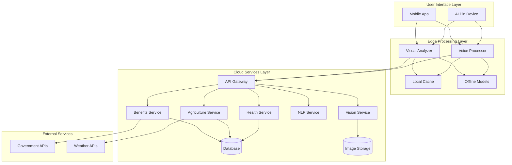

# Design Document: KISSAN AI Companion

## Overview

KISSAN is a hybrid edge-cloud AI system designed to provide real-time assistance to rural families across health, agriculture, and government benefits domains. The architecture prioritizes dual-mode operation: small quantized models (200-300MB) for offline functionality and comprehensive AWS cloud services for advanced online capabilities. The system features multilingual voice interaction to serve users with limited literacy and unreliable connectivity.

The offline mode uses lightweight models (Whisper-tiny, DistilBERT, MobileNetV3) achieving 70-80% accuracy for common scenarios. The online mode leverages full AWS infrastructure (Amazon Bedrock with Claude, Rekognition, Transcribe, Polly, SageMaker) delivering 90-95% accuracy with advanced reasoning and analysis. Intelligent mode switching ensures seamless operation regardless of connectivity status.

### Key Design Principles

1. **Hybrid Edge-Cloud Architecture**: Small optimized models run on-device for offline operation, full AWS cloud services provide advanced capabilities when online
2. **Voice-First Interface**: All features accessible through natural language voice commands
3. **Visual Intelligence**: Camera-based analysis for health and crop assessment
4. **Intelligent Mode Switching**: Seamless transition between offline (small models) and online (AWS services) based on connectivity
5. **Graceful Degradation**: System remains functional with reduced connectivity using cached data and edge models
6. **Cultural Sensitivity**: Design adapted for rural Indian context and languages
7. **Affordability**: Hardware and operational costs optimized for rural economics

### System Components

- **AI Pin Device**: Embedded system with camera, microphone, speaker, and edge AI processing
- **Mobile Application**: Android app providing full system access via smartphone
- **AWS Cloud Services**: Comprehensive cloud infrastructure with AI/ML services, databases, storage, and APIs
- **Edge AI Models**: Small, quantized models (5-150MB) for offline operation with basic functionality
- **Cloud AI Models**: Full-scale AWS AI services (Bedrock, Rekognition, Transcribe, Polly) for advanced analysis
- **Voice Processing Pipeline**: Dual-mode - lightweight on-device for offline, AWS Transcribe/Polly for online
- **Visual Analysis Engine**: Dual-mode - MobileNet-based edge models for offline, AWS Rekognition + SageMaker for online
- **Connectivity Manager**: Intelligent switching between offline and online modes based on network availability

## Architecture

### High-Level Architecture



### Dual-Mode Architecture: Offline vs Online

**Offline Mode (Small Models on Edge):**
- Model Size Budget: 200-300MB total for all models
- Speech Recognition: Whisper-tiny (39MB) or Whisper-base (74MB), quantized to INT8
- Intent Classification: DistilBERT-multilingual (66MB) quantized to INT8 (~25MB)
- Image Classification: MobileNetV3-Small (2.5MB) or EfficientNet-Lite0 (4.5MB)
- Crop Disease Detection: Custom MobileNet model (15MB)
- Text-to-Speech: Piper TTS (10-30MB per language, 2-3 languages preloaded)
- Knowledge Base: SQLite database with common queries, remedies, and guidance (50MB)
- Capabilities: Basic symptom checking, common crop disease identification, cached scheme info
- Accuracy: 70-80% for common cases
- Response Time: 2-5 seconds

**Online Mode (AWS Cloud Services):**
- Speech Recognition: Amazon Transcribe with custom medical/agricultural vocabulary
- NLU & Reasoning: Amazon Bedrock (Claude 3 Haiku for speed, Sonnet for complexity)
- Image Analysis: Amazon Rekognition Custom Labels + SageMaker (ResNet50, EfficientNet-B4, YOLO)
- Text-to-Speech: Amazon Polly Neural voices (natural, expressive)
- Knowledge Base: Amazon Bedrock Knowledge Bases with RAG over comprehensive medical/agricultural corpus
- Real-time Data: AWS Lambda functions querying government APIs, weather services
- Storage: Amazon S3 for images, RDS/DynamoDB for structured data
- Capabilities: Advanced diagnosis, rare disease detection, real-time scheme updates, personalized recommendations
- Accuracy: 90-95% with confidence scores
- Response Time: 3-8 seconds (including network latency)

**Mode Switching Logic:**
```typescript
interface ConnectivityManager {
  // Check current connectivity status
  checkConnectivity(): Promise<ConnectivityStatus>
  
  // Determine which mode to use for a request
  selectMode(requestType: RequestType, priority: Priority): OperationMode
  
  // Switch between modes seamlessly
  switchMode(newMode: OperationMode): Promise<void>
}

enum OperationMode {
  OFFLINE_ONLY,      // No connectivity, use edge models
  ONLINE_PREFERRED,  // Good connectivity, use AWS services
  HYBRID            // Intermittent connectivity, use both strategically
}

interface ConnectivityStatus {
  isOnline: boolean
  bandwidth: number  // Kbps
  latency: number    // ms
  reliability: number  // 0.0 to 1.0
  dataUsageMode: DataUsageMode
}
```

**Hybrid Mode Strategy:**
- Use edge models for initial quick response
- Send request to AWS in parallel for detailed analysis
- Update user with refined results when cloud response arrives
- Cache cloud results for future offline use
- Prioritize critical requests for cloud processing

### Component Interactions

**Voice Interaction Flow:**
1. User speaks in local language
2. Edge voice processor converts speech to text (offline-capable)
3. Intent classification happens on-device for common queries
4. Complex queries sent to cloud NLP service
5. Response generated and converted to speech
6. Audio played through device speaker

**Visual Analysis Flow:**
1. User captures image with camera
2. Edge preprocessor optimizes image (compression, enhancement)
3. Basic analysis attempted on-device
4. Full analysis performed in cloud if connectivity available
5. Results cached locally for offline reference
6. Recommendations provided via voice

**Offline Operation:**
1. System detects connectivity loss
2. Switches to small quantized edge models (MobileNet, Whisper-tiny, DistilBERT)
3. Uses cached data and local knowledge base
4. Provides basic functionality with confidence indicators
5. Queues non-critical requests for cloud processing
6. Syncs when connectivity restored

**Online Operation with AWS:**
1. System detects internet connectivity
2. Routes requests to AWS API Gateway
3. Uses full-scale AWS AI services:
   - Amazon Transcribe for accurate speech recognition
   - Amazon Bedrock (Claude) for advanced reasoning and NLU
   - Amazon Rekognition + SageMaker for detailed image analysis
   - Amazon Polly for natural voice synthesis
4. Accesses real-time data (weather, schemes, jobs) from AWS databases
5. Stores results in Amazon S3 and caches in ElastiCache
6. Provides comprehensive analysis with high confidence

### Technology Stack

**AI Pin Hardware:**
- Processor: ARM Cortex-A53 or equivalent (low power, sufficient for edge AI)
- RAM: 2GB minimum
- Storage: 16GB eMMC (for models and cache)
- Camera: 8MP with autofocus
- Connectivity: WiFi 802.11n, Bluetooth 5.0
- Battery: 3000mAh (12+ hours operation)
- OS: Embedded Linux (Yocto or similar)

**Mobile App:**
- Platform: Android 8.0+ (Kotlin/Java)
- UI Framework: Jetpack Compose for modern, efficient UI
- Local Database: SQLite with Room
- Networking: Retrofit with OkHttp
- Image Processing: TensorFlow Lite

**Backend Services (AWS Cloud):**
- Compute: AWS Lambda (serverless functions), AWS ECS/Fargate (containerized services)
- API Gateway: AWS API Gateway with REST and WebSocket support
- Databases: Amazon RDS (PostgreSQL for structured data), Amazon DynamoDB (NoSQL for high-scale data)
- Object Storage: Amazon S3 for images and model artifacts
- AI/ML Services: 
  - Amazon Bedrock (Claude, Llama models for NLU and reasoning)
  - Amazon Transcribe (speech-to-text with Indian language support)
  - Amazon Polly (text-to-speech for local languages)
  - Amazon Rekognition (image analysis and object detection)
  - Amazon SageMaker (custom model training and deployment)
- Message Queue: Amazon SQS, Amazon SNS for notifications
- Caching: Amazon ElastiCache (Redis) for fast data access
- CDN: Amazon CloudFront for content delivery
- Monitoring: Amazon CloudWatch, AWS X-Ray for tracing
- Authentication: Amazon Cognito for user management

**AI Models - Offline Mode (Small, Optimized Models):**
- Speech Recognition: Whisper-tiny/base (quantized INT8, ~40-150MB) or IndicWav2Vec-small
- NLU: DistilBERT or MobileBERT (quantized, ~25-50MB) for intent classification
- Vision: MobileNetV3 or EfficientNet-Lite (quantized, ~5-20MB) for basic classification
- TTS: Lightweight Piper TTS or quantized Coqui models (~10-30MB per language)
- Crop Disease Detection: Custom MobileNet-based model (quantized, ~15MB)
- Symptom Classifier: Lightweight decision tree or small neural network (~5MB)

**AI Models - Online Mode (AWS-Powered):**
- Speech Recognition: Amazon Transcribe with custom vocabulary for medical/agricultural terms
- NLU: Amazon Bedrock (Claude 3 Haiku for fast responses, Claude 3 Sonnet for complex reasoning)
- Vision: Amazon Rekognition Custom Labels + SageMaker-hosted ResNet/EfficientNet models
- TTS: Amazon Polly with Neural voices for natural speech in Indian languages
- Advanced Analysis: SageMaker endpoints with large models (YOLO, Vision Transformers)
- Knowledge Base: Amazon Bedrock Knowledge Bases with RAG for scheme information

## Components and Interfaces

### 1. Voice Interface Component

**Responsibilities:**
- Convert speech to text in local languages
- Extract user intent and entities
- Generate natural language responses
- Convert text to speech in local languages
- Handle conversation context and multi-turn dialogues

**Interfaces:**

```typescript
interface VoiceInterface {
  // Process voice input and return intent
  processVoiceInput(audioData: AudioBuffer, language: Language): Promise<Intent>
  
  // Generate voice response from text
  generateVoiceOutput(text: string, language: Language): Promise<AudioBuffer>
  
  // Check if language is supported
  isLanguageSupported(language: Language): boolean
  
  // Get available languages
  getAvailableLanguages(): Language[]
}

interface Intent {
  type: IntentType  // HEALTH_QUERY, CROP_ANALYSIS, SCHEME_INFO, etc.
  entities: Map<string, any>  // Extracted entities (symptoms, crop type, etc.)
  confidence: number  // 0.0 to 1.0
  rawText: string  // Transcribed text
  language: Language
}

enum IntentType {
  HEALTH_QUERY_HUMAN,
  HEALTH_QUERY_LIVESTOCK,
  CROP_ANALYSIS,
  FARMING_GUIDANCE,
  SCHEME_INFO,
  JOB_INFO,
  GENERAL_QUERY
}

type Language = 'hi' | 'ta' | 'te' | 'mr' | 'bn' | 'gu' | 'kn' | 'ml' | 'pa' | 'or'
```

### 2. Visual Analysis Component

**Responsibilities:**
- Capture and preprocess images
- Analyze images for health conditions (human and livestock)
- Analyze images for crop health and diseases
- Detect pests and nutrient deficiencies
- Provide confidence scores for analysis

**Interfaces:**

```typescript
interface VisualAnalyzer {
  // Analyze image for health assessment
  analyzeHealthImage(image: ImageData, subject: HealthSubject): Promise<HealthAnalysis>
  
  // Analyze image for crop assessment
  analyzeCropImage(image: ImageData, cropType?: string): Promise<CropAnalysis>
  
  // Preprocess image for analysis
  preprocessImage(image: ImageData): ImageData
}

interface HealthAnalysis {
  subject: HealthSubject  // HUMAN, CATTLE, GOAT, BUFFALO
  conditions: Condition[]  // Detected conditions
  confidence: number
  recommendations: string[]
  criticalAlert: boolean
  imageId: string
}

interface CropAnalysis {
  cropType: string
  healthStatus: CropHealthStatus
  diseases: Disease[]
  pests: Pest[]
  nutrientDeficiencies: NutrientDeficiency[]
  recommendations: string[]
  confidence: number
  imageId: string
}

enum HealthSubject {
  HUMAN,
  CATTLE,
  GOAT,
  BUFFALO
}

enum CropHealthStatus {
  HEALTHY,
  MILD_STRESS,
  MODERATE_STRESS,
  SEVERE_STRESS,
  CRITICAL
}
```

### 3. Health Module Component

**Responsibilities:**
- Provide health guidance for humans and livestock
- Suggest home remedies for minor ailments
- Recommend medications with dosage
- Generate critical alerts for serious conditions
- Maintain health history

**Interfaces:**

```typescript
interface HealthModule {
  // Get health guidance based on symptoms
  getHealthGuidance(symptoms: string[], subject: HealthSubject, language: Language): Promise<HealthGuidance>
  
  // Get medication recommendations
  getMedicationGuidance(condition: string, subject: HealthSubject, language: Language): Promise<MedicationGuidance>
  
  // Analyze visual health assessment
  analyzeHealthVisual(analysis: HealthAnalysis, language: Language): Promise<HealthGuidance>
  
  // Get health history
  getHealthHistory(userId: string, subject?: HealthSubject): Promise<HealthRecord[]>
}

interface HealthGuidance {
  condition: string
  severity: Severity
  homeRemedies: Remedy[]
  medications: Medication[]
  criticalAlert: boolean
  hospitalRecommended: boolean
  preventiveMeasures: string[]
  language: Language
}

interface MedicationGuidance {
  medications: Medication[]
  dosageInstructions: string[]
  precautions: string[]
  duration: string
  language: Language
}

interface Medication {
  name: string
  dosage: string
  timing: string[]  // "morning", "afternoon", "evening", "night"
  withFood: boolean
}

enum Severity {
  MINOR,
  MODERATE,
  SERIOUS,
  CRITICAL
}
```

### 4. Agriculture Module Component

**Responsibilities:**
- Analyze crop health from images
- Provide farming method guidance
- Recommend optimal timing for activities
- Send proactive alerts for weather and seasonal activities
- Track crop progress over time

**Interfaces:**

```typescript
interface AgricultureModule {
  // Get crop guidance from visual analysis
  getCropGuidance(analysis: CropAnalysis, language: Language): Promise<CropGuidance>
  
  // Get farming method recommendations
  getFarmingGuidance(cropType: string, activity: FarmingActivity, language: Language): Promise<FarmingGuidance>
  
  // Get optimal timing for activities
  getTimingGuidance(cropType: string, location: Location, language: Language): Promise<TimingGuidance>
  
  // Get crop health timeline
  getCropTimeline(userId: string, cropId: string): Promise<CropHealthRecord[]>
  
  // Generate proactive alerts
  generateAlerts(userId: string, location: Location): Promise<Alert[]>
}

interface CropGuidance {
  cropType: string
  healthStatus: CropHealthStatus
  problems: Problem[]
  treatments: Treatment[]
  preventiveMeasures: string[]
  estimatedRecoveryTime: string
  language: Language
}

interface FarmingGuidance {
  activity: FarmingActivity
  steps: string[]
  materials: string[]
  timing: string
  precautions: string[]
  language: Language
}

interface TimingGuidance {
  cropType: string
  currentSeason: string
  upcomingActivities: ScheduledActivity[]
  weatherConsiderations: string[]
  language: Language
}

enum FarmingActivity {
  PLANTING,
  IRRIGATION,
  FERTILIZATION,
  PEST_CONTROL,
  HARVESTING,
  SOIL_PREPARATION
}
```

### 5. Benefits Module Component

**Responsibilities:**
- Provide information about government schemes
- Match users with eligible schemes
- Provide job opportunity information
- Track application status
- Send proactive notifications

**Interfaces:**

```typescript
interface BenefitsModule {
  // Get schemes relevant to user
  getEligibleSchemes(userProfile: UserProfile, language: Language): Promise<Scheme[]>
  
  // Get detailed scheme information
  getSchemeDetails(schemeId: string, language: Language): Promise<SchemeDetails>
  
  // Get job opportunities
  getJobOpportunities(userProfile: UserProfile, language: Language): Promise<Job[]>
  
  // Track application status
  trackApplication(applicationId: string): Promise<ApplicationStatus>
  
  // Get new schemes and jobs
  getNewOpportunities(userId: string, language: Language): Promise<Opportunity[]>
}

interface Scheme {
  id: string
  name: string
  description: string
  eligibilityCriteria: string[]
  benefits: string[]
  applicationDeadline?: Date
  category: SchemeCategory
  language: Language
}

interface SchemeDetails extends Scheme {
  applicationSteps: string[]
  requiredDocuments: string[]
  contactInfo: ContactInfo
  faqItems: FAQ[]
}

interface Job {
  id: string
  title: string
  department: string
  qualifications: string[]
  applicationDeadline: Date
  salary: string
  location: string
  language: Language
}

enum SchemeCategory {
  AGRICULTURE,
  HEALTH,
  EDUCATION,
  HOUSING,
  EMPLOYMENT,
  SOCIAL_WELFARE
}
```

### 6. Cache and Offline Component

**Responsibilities:**
- Cache frequently accessed data
- Store edge AI models
- Queue requests during offline periods
- Synchronize data when connectivity restored
- Manage storage efficiently

**Interfaces:**

```typescript
interface CacheManager {
  // Cache data with expiration
  cacheData(key: string, data: any, ttl: number): Promise<void>
  
  // Retrieve cached data
  getCachedData(key: string): Promise<any | null>
  
  // Check if data is cached and valid
  isCached(key: string): Promise<boolean>
  
  // Clear expired cache
  clearExpiredCache(): Promise<void>
  
  // Get cache statistics
  getCacheStats(): Promise<CacheStats>
}

interface OfflineQueue {
  // Queue request for later processing
  queueRequest(request: Request): Promise<void>
  
  // Get pending requests
  getPendingRequests(): Promise<Request[]>
  
  // Process queued requests
  processQueue(): Promise<ProcessResult[]>
  
  // Clear processed requests
  clearProcessed(): Promise<void>
}

interface SyncManager {
  // Sync local data with cloud
  syncData(): Promise<SyncResult>
  
  // Check sync status
  getSyncStatus(): Promise<SyncStatus>
  
  // Register sync listener
  onSyncComplete(callback: (result: SyncResult) => void): void
}
```

### 7. User Profile Component

**Responsibilities:**
- Manage user preferences and settings
- Store user profile information
- Track user interactions and history
- Manage family member profiles
- Handle privacy settings

**Interfaces:**

```typescript
interface UserProfileManager {
  // Create or update user profile
  updateProfile(userId: string, profile: UserProfile): Promise<void>
  
  // Get user profile
  getProfile(userId: string): Promise<UserProfile>
  
  // Add family member
  addFamilyMember(userId: string, member: FamilyMember): Promise<string>
  
  // Update preferences
  updatePreferences(userId: string, preferences: UserPreferences): Promise<void>
  
  // Get user history
  getUserHistory(userId: string, type: HistoryType): Promise<HistoryRecord[]>
}

interface UserProfile {
  userId: string
  name: string
  phoneNumber: string
  location: Location
  preferredLanguage: Language
  familyMembers: FamilyMember[]
  landHolding?: number  // in acres
  crops: string[]
  livestock: LivestockInfo[]
  preferences: UserPreferences
}

interface UserPreferences {
  notificationsEnabled: boolean
  voiceSpeed: number  // 0.5 to 2.0
  dataUsageMode: DataUsageMode  // LOW, MEDIUM, HIGH
  privacySettings: PrivacySettings
}

enum DataUsageMode {
  LOW,      // Minimal data, aggressive caching
  MEDIUM,   // Balanced
  HIGH      // Full features, less caching
}
```

## Data Models

### Core Data Structures

```typescript
// Location information
interface Location {
  latitude: number
  longitude: number
  district: string
  state: string
  pincode: string
}

// Health-related models
interface HealthRecord {
  id: string
  userId: string
  subject: HealthSubject
  subjectId?: string  // Family member or livestock ID
  timestamp: Date
  symptoms: string[]
  diagnosis: string
  guidance: HealthGuidance
  imageIds: string[]
  followUp?: Date
}

interface Condition {
  name: string
  confidence: number
  severity: Severity
  description: string
}

interface Remedy {
  name: string
  ingredients: string[]
  preparation: string[]
  usage: string
  precautions: string[]
}

// Agriculture-related models
interface CropHealthRecord {
  id: string
  userId: string
  cropId: string
  cropType: string
  timestamp: Date
  analysis: CropAnalysis
  guidance: CropGuidance
  imageIds: string[]
  actionsTaken: string[]
}

interface Disease {
  name: string
  confidence: number
  severity: Severity
  description: string
  causes: string[]
}

interface Pest {
  name: string
  confidence: number
  severity: Severity
  description: string
}

interface NutrientDeficiency {
  nutrient: string
  confidence: number
  severity: Severity
  symptoms: string[]
}

interface Treatment {
  type: TreatmentType
  name: string
  application: string[]
  dosage: string
  timing: string
  cost: string
  availability: string
}

enum TreatmentType {
  CHEMICAL,
  ORGANIC,
  BIOLOGICAL,
  CULTURAL
}

interface ScheduledActivity {
  activity: FarmingActivity
  recommendedDate: Date
  window: number  // days before/after
  priority: Priority
  description: string
}

enum Priority {
  LOW,
  MEDIUM,
  HIGH,
  CRITICAL
}

// Benefits-related models
interface ApplicationStatus {
  applicationId: string
  schemeId: string
  status: ApplicationState
  submittedDate: Date
  lastUpdated: Date
  nextSteps: string[]
  documents: Document[]
}

enum ApplicationState {
  DRAFT,
  SUBMITTED,
  UNDER_REVIEW,
  APPROVED,
  REJECTED,
  COMPLETED
}

interface ContactInfo {
  phone: string[]
  email: string[]
  website: string
  officeAddress: string
}

interface FAQ {
  question: string
  answer: string
}

// System models
interface Alert {
  id: string
  userId: string
  type: AlertType
  priority: Priority
  title: string
  message: string
  timestamp: Date
  expiresAt?: Date
  actionRequired: boolean
  actionUrl?: string
}

enum AlertType {
  HEALTH_CRITICAL,
  CROP_URGENT,
  WEATHER_WARNING,
  SCHEME_DEADLINE,
  JOB_OPPORTUNITY,
  SYSTEM_UPDATE
}

interface ImageData {
  data: Buffer | Uint8Array
  width: number
  height: number
  format: ImageFormat
  metadata?: ImageMetadata
}

enum ImageFormat {
  JPEG,
  PNG,
  WEBP
}

interface ImageMetadata {
  capturedAt: Date
  location?: Location
  deviceId: string
  lighting?: LightingCondition
}

enum LightingCondition {
  BRIGHT_SUNLIGHT,
  CLOUDY,
  SHADE,
  INDOOR,
  LOW_LIGHT
}

// Family and livestock models
interface FamilyMember {
  id: string
  name: string
  age: number
  gender: Gender
  relation: string
  healthHistory: string[]
}

enum Gender {
  MALE,
  FEMALE,
  OTHER
}

interface LivestockInfo {
  id: string
  type: HealthSubject  // CATTLE, GOAT, BUFFALO
  count: number
  breed?: string
  healthHistory: string[]
}

// Privacy and security models
interface PrivacySettings {
  shareDataForResearch: boolean
  storeImages: boolean
  shareLocationData: boolean
  allowPersonalization: boolean
}

// Sync and offline models
interface SyncResult {
  success: boolean
  itemsSynced: number
  errors: SyncError[]
  timestamp: Date
}

interface SyncError {
  itemId: string
  error: string
  retryable: boolean
}

interface SyncStatus {
  lastSyncTime: Date
  pendingItems: number
  syncInProgress: boolean
  nextScheduledSync: Date
}

interface CacheStats {
  totalSize: number  // bytes
  itemCount: number
  hitRate: number  // 0.0 to 1.0
  oldestItem: Date
}

// Request models
interface Request {
  id: string
  type: RequestType
  payload: any
  timestamp: Date
  priority: Priority
  retryCount: number
}

enum RequestType {
  HEALTH_QUERY,
  CROP_ANALYSIS,
  SCHEME_QUERY,
  JOB_QUERY,
  SYNC_DATA
}

interface ProcessResult {
  requestId: string
  success: boolean
  response?: any
  error?: string
}

// History models
interface HistoryRecord {
  id: string
  userId: string
  type: HistoryType
  timestamp: Date
  summary: string
  details: any
}

enum HistoryType {
  HEALTH_CONSULTATION,
  CROP_ANALYSIS,
  SCHEME_INQUIRY,
  JOB_INQUIRY,
  SYSTEM_INTERACTION
}

interface Opportunity {
  type: OpportunityType
  id: string
  title: string
  description: string
  deadline?: Date
  priority: Priority
}

enum OpportunityType {
  NEW_SCHEME,
  NEW_JOB,
  SCHEME_UPDATE,
  SEASONAL_ALERT
}
```

### Database Schema Design

**Users Table:**
- user_id (PK)
- phone_number (unique)
- name
- location_data (JSON)
- preferred_language
- created_at
- updated_at

**Family Members Table:**
- member_id (PK)
- user_id (FK)
- name
- age
- gender
- relation
- created_at

**Livestock Table:**
- livestock_id (PK)
- user_id (FK)
- type
- count
- breed
- created_at

**Health Records Table:**
- record_id (PK)
- user_id (FK)
- subject_type
- subject_id (FK - nullable)
- timestamp
- symptoms (JSON)
- diagnosis
- guidance (JSON)
- image_ids (JSON)
- follow_up_date

**Crop Records Table:**
- record_id (PK)
- user_id (FK)
- crop_id
- crop_type
- timestamp
- analysis (JSON)
- guidance (JSON)
- image_ids (JSON)
- actions_taken (JSON)

**Schemes Table:**
- scheme_id (PK)
- name
- description
- eligibility_criteria (JSON)
- benefits (JSON)
- category
- deadline
- active
- created_at
- updated_at

**Jobs Table:**
- job_id (PK)
- title
- department
- qualifications (JSON)
- deadline
- salary
- location
- active
- created_at

**Applications Table:**
- application_id (PK)
- user_id (FK)
- scheme_id (FK) or job_id (FK)
- status
- submitted_date
- last_updated
- documents (JSON)

**Alerts Table:**
- alert_id (PK)
- user_id (FK)
- type
- priority
- title
- message
- timestamp
- expires_at
- read
- action_required

**Images Table:**
- image_id (PK)
- user_id (FK)
- storage_path
- metadata (JSON)
- uploaded_at
- analysis_type

## Correctness Properties


*A property is a characteristic or behavior that should hold true across all valid executions of a system—essentially, a formal statement about what the system should do. Properties serve as the bridge between human-readable specifications and machine-verifiable correctness guarantees.*

### Property 1: Response Time Guarantees

*For any* user query (health, crop analysis, or scheme information), the system SHALL provide a response within the specified time limit for that query type: health queries within 10 seconds, crop analysis within 15 seconds, and scheme queries within 5 seconds.

**Validates: Requirements 1.1, 3.1, 10.1, 10.2, 10.3**

### Property 2: Language Consistency

*For any* user interaction in a selected local language, all system responses (voice output, text display, and guidance) SHALL be provided in that same language.

**Validates: Requirements 1.4, 3.4, 7.2, 11.2, 11.3, 11.4**

### Property 3: Medication Guidance Completeness

*For any* medication guidance request, the response SHALL include tablet names, dosage amounts, and timing instructions (morning, afternoon, evening, night).

**Validates: Requirements 1.2**

### Property 4: Critical Condition Detection

*For any* set of symptoms (human or livestock) that indicate a critical condition, the system SHALL generate a Critical_Alert recommending immediate professional medical or veterinary consultation.

**Validates: Requirements 1.3, 2.3**

### Property 5: Health Data Persistence

*For any* health consultation, crop analysis, or job interest record created by the system, querying the appropriate history or record should return that entry with all its details intact.

**Validates: Requirements 1.5, 3.5, 6.5**

### Property 6: Livestock-Specific Guidance

*For any* symptom description, when provided for different livestock types (cattle, goats, buffaloes), the treatment guidance SHALL be appropriately differentiated based on the animal species.

**Validates: Requirements 2.4**

### Property 7: Visual Analysis Completeness

*For any* crop image where disease, pest, or nutrient deficiency is detected, the analysis response SHALL include identification of the specific problem and treatment recommendations.

**Validates: Requirements 3.2, 3.3**

### Property 8: Farming Guidance S